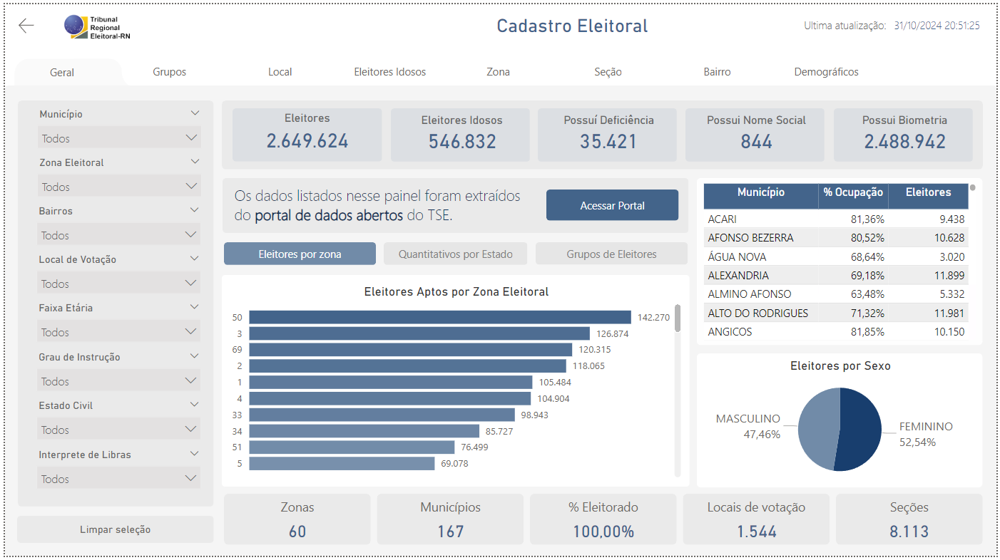
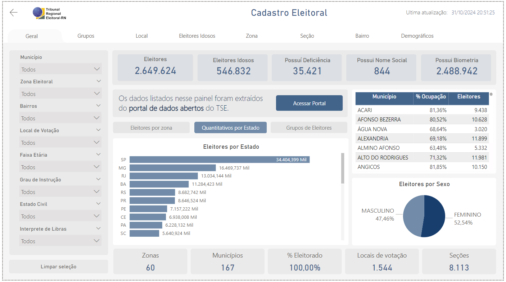
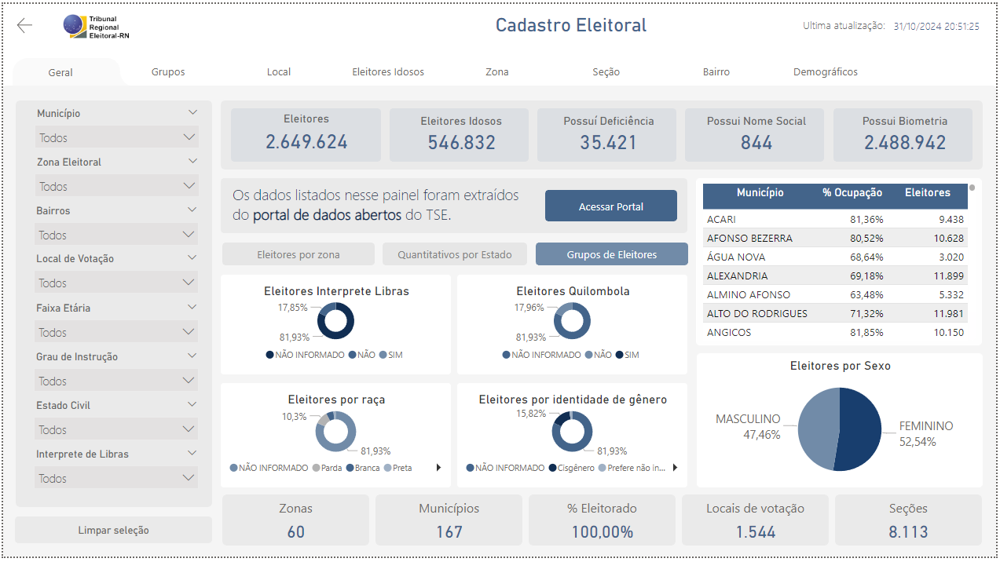

# BICADELEITORAL: Visualizações de Dados

## Visão Geral

Este projeto tem como objetivo desenvolver um dashboard para análise do cadastro eleitoral do Rio Grande do Norte. O painel apresenta informações sobre o eleitorado, explorando diferentes aspectos, como bairros, municípios, zonas eleitorais e outros. Ele oferece uma visão geral abrangente das informações.
A ferramenta de visualização utilizada é o **Power BI**, que extrai os dados da camada 3 do datalake do TRE-RN.

---

## Sobre as Visualizações

As visualizações são criadas para ajudar na análise e tomada de decisões com base nos dados processados.
A ferramenta utilizada para criação dos dashboards é o **Power BI**.
A visualização é dividida em 10 paginas:

### Capa

Esta pagina é uma apresentação do painel, e contém alguns elementos graficos. Seu propósito é apresentar uma descrição reduzida do painel, mostrar a última data de atualização e a autoria do desenvolvimento.


#### Visuais:
- **Indicador - Data de atualização**: Ao lado do botão tem um cartão que apresenta a data de atualização dos dados
- **Botão**: Único botão na tela, ele leva a página principal do painel


### Geral

Este painel no Power BI oferece uma visão consolidada dos dados, reunindo informações de diferentes seções do dashboard. Ele apresenta uma perspectiva geral, proporcionando uma compreensão ampla e integrada das informações disponíveis.



Essa pagina do painel tem duas outras variações, que são criadas a partir dos indicadores ao apetrar em um dos seguintes botões: Eleitores por Zona, Quantitativos por Estado e Grupos de Eleitores. As variações podem ser vistas na imagem abaixo:

**Quantitativo por Estado:**


**Grupos de Eleitores**



#### Visuais:
- **Indicador - Eleitores:** Total de eleitores cadastrados (2.649.624).
- **Indicador - Eleitores Idosos:** Quantidade de eleitores idosos (546.832).
- **Indicador - Possui Deficiência:** Número de eleitores com deficiência (35.421).
- **Indicador - Possui Nome Social:** Quantidade de eleitores com nome social registrado (844).
- **Indicador - Possui Biometria:** Total de eleitores com biometria registrada (2.488.942).
- **Gráfico de Coluna Horizontal - Eleitores Aptos por Zona Eleitoral:** Apresenta o quantitativo de eleitores aptos por cada zona eleitoral, com os valores ordenados.
- **Gráfico de Coluna Horizontal - Eleitores por Estado:** Apresenta o quantitativo de eleitores por estado.
- **Gráfico de Rosca - Eleitores Interprete Libras:** Representação da distribuição percentual dos eleitores entre (SIM/NÃO/NÃO INFORMADO)
- **Gráfico de Rosca - Eleitores Quilombola:** Representação da distribuição percentual dos eleitores entre (SIM/NÃO/NÃO INFORMADO)
- **Gráfico de Rosca - Eleitores por Raça** Representação da distribuição percentual dos eleitores entre (NÃO INFORMADO/BRANCA/PARDA/PRETA/AMAERA/INDIGENA)
- **Gráfico de Rosca - Eleitores por identidade de gênero** Representação da distribuição percentual dos eleitores entre (NÃO INFORMADO/PREFERE NÃO RESPONDER/CISGÊNERO/TRANSGÊNERO)
- **Tabela - Municípios com Maior Ocupação:** Mostra a porcentagem de ocupação e o número total de eleitores por município.
- **Gráfico de Pizza - Eleitores por Sexo:** Representa a distribuição percentual dos eleitores entre masculino (47,46%) e feminino (52,54%).
- **Indicadores Resumidos na Parte Inferior:** Zonas Eleitorais: Quantidade de zonas (60).
- **Municípios:** Total de municípios (167).
- **% Eleitorado:** Percentual do eleitorado abrangido (100%).
- **Locais de Votação:** Número total de locais de votação (1.544).
- **Seções Eleitorais:** Quantidade de seções (8.113).
- **Informação Adicional:** O painel exibe que os dados foram extraídos do portal de dados abertos do TSE, com um botão para acessar o portal.


#### Filtros
- **Município:** Permite filtrar os dados por município.
- **Zona Eleitoral:** Filtra os dados com base na zona eleitoral.
- **Bairros:** Oferece a opção de filtrar por bairros.
- **Local de Votação:** Permite filtrar com base nos locais de votação.
- **Faixa Etária:** Filtra os dados de acordo com a faixa etária dos eleitores.
- **Grau de Instrução:** Filtra os dados com base no grau de instrução dos eleitores.
- **Estado Civil:** Permite filtrar de acordo com o estado civil dos eleitores.
- **Intérprete de Libras:** Filtra os dados considerando a necessidade de intérprete de Libras.

---

## Sobre os Dados

Os dados utilizados para criação dos gráficos são retirados do DataLake, a partir das tabelas:

<details>
<summary>etitulo.etitulo.etitulo</summary>

| Campo                      | Descrição                                                            | Tipo       | Exemplo                        |
|----------------------------|----------------------------------------------------------------------|------------|--------------------------------|
| **UF**                     | UF                                                                   | timestamp  | RN                             |
| **QTDE_PRIMEIRA_EMISSAO**  | Quantidade das primeiras emissões                                    | inteiro    | 887110                         |
| **QTDE_REMISSAO**          | Quantidade das reemissões                                            | inteiro    | 2541                           |
| **QTDE_EMISSAO**           | Quantidade das emissões                                              | inteiro    | 42232                          |
| **DATA_RASPAGEM**          | Data atualizações dos dados                                          | timestamp  | 2024-09-14 04:00:00+00:00      |
| **DATA_OBJETO**            | Data atualizações dos dados                                          | timestamp  | 2024-09-14 04:00:00+00:00      |
| **SG_UF**                  | UF                                                                   | string     | CO                             |
| **QT_ELEITORES_PERFIL**    | Quantidade Eleitores                                                 | inteiro    | 42232                          |
| **EXTRAIDO_EM**            | Data atualizações dos dados                                          | timestamp  | 2024-09-14 04:00:00+00:00      |
| **regiao_nome**            | Região do estado                                                     | string     | Centro-Oeste                   |
| **uf_brlocalidades**       | UF                                                                   | string     | RJ                             |
| **populacao_total**        | População total do estado                                            | inteiro    | 12223                          |

</details>

---
## Medidas

<details>
<summary>Medidas</summary>

**PrimeiraEmissaoAtual** - Quantidade de primeiras emissões considerando a ultima data (Existem varias duplicatas dos dados na tabela, então é necessário selecionar somente a última)
```DAX
CALCULATE(
    SUM('etitulo etitulo'[QTDE_PRIMEIRA_EMISSAO]),
    'etitulo etitulo'[DATA_OBJETO]=max('etitulo etitulo'[DATA_OBJETO])
)
```

**QtdReemissõesAtual** - Quantidade de reemissões considerando a última data.
```DAX
CALCULATE(
    SUM('etitulo etitulo'[QTDE_REMISSAO]),
    'etitulo etitulo'[DATA_OBJETO]=max('etitulo etitulo'[DATA_OBJETO])
)
```

**QtdEmissõesTotais** - Quantidade de emissões totais considerando ultima data
```DAX
CALCULATE(
    SUM('etitulo etitulo'[QTDE_EMISSAO]),
    'etitulo etitulo'[DATA_OBJETO]=max('etitulo etitulo'[DATA_OBJETO])
)
```

**% Emissões por Eleitorado** - Divisão de quantidade de emissões totais pela quantidade de eleitores em determinado estado.
```DAX
VAR totalEleitores = CALCULATE(
    SUM('etitulo etitulo'[QT_ELEITORES_PERFIL]),
    'etitulo etitulo'[DATA_OBJETO]=max('etitulo etitulo'[DATA_OBJETO])
)

VAR totalEmissoes = [QtdEmissaoTotal]

RETURN DIVIDE(totalEmissoes,totalEleitores)
```

**Qtd. Eleitorado** - Total de Eleitores em um estado considerando a última atualização
```DAX
CALCULATE(
    SUM('etitulo etitulo'[QT_ELEITORES_PERFIL]),
    'etitulo etitulo'[DATA_OBJETO]=max('etitulo etitulo'[DATA_OBJETO])
)
```

**Rank % Emissões** - Rank de % de Emissões
```DAX
RANKX(
    ALL('etitulo etitulo'[UF]),
    [% Emissoes por Eleitorado],
    ,DESC,
    Skip
)
```

**Rank % Emissões RN** - A posição do Rank de % de Emissões (Usei separado dessa forma e não fiz um filtro, pois utilizei dentro do texto)
```DAX
CALCULATE(
    [Rank % Emissões],
    'etitulo etitulo'[UF]="RN"
)
```

**QtdEmissãoTotalRN** - Quantidade de emissões totais somente para o estado do RN
```DAX
CALCULATE(
    SUM('etitulo etitulo'[QTDE_EMISSAO]),
    'etitulo etitulo'[DATA_OBJETO]=max('etitulo etitulo'[DATA_OBJETO]),
    'etitulo etitulo'[UF]="RN"
)
```

**Rank % Emissões RN Nordeste** - Posição do rank da % Emissão do RN dentro da região Nordeste
```DAX
CALCULATE(
    [Rank % Emissões],
    'etitulo etitulo'[UF]="RN",
    'etitulo etitulo'[regiao_nome]="Nordeste"
)
```
</details>


--
## Requisitos

- **Power BI**: Para criação das visualizações.
---

<!-- ## Instruções de Instalação

1. Clone o repositório:

```bash
git clone https://gitlab.com/seu-usuario/projeto-etl-visualizacoes.git
cd projeto-etl-visualizacoes -->